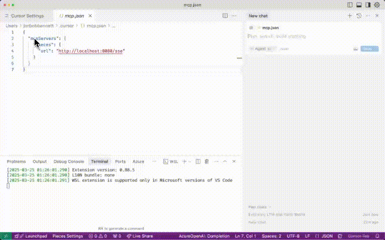

# A demo MCP server in Dart

This is a simple demo MCP server written in dart. It exists just to see how to implement it, and is not a reference implementation.

## Run the server

This is a shelf server, so you can run with:

```bash
dart run bin/server.dart
```

## Configure the MCP client

Once the server is running, you can configure your MCP client to point to the SSE endpoint. For example, in Cursor, use:

```json
{
  "mcpServers": {
    "Pieces": {
      "url": "http://localhost:8080/sse"
    }
  }
}
```

This will add the MCP server. You can then use it by asking "ask pieces ltm hello world".

At the moment this doesn't actually interact with PiecesOS, instead it just returns dummy data.


